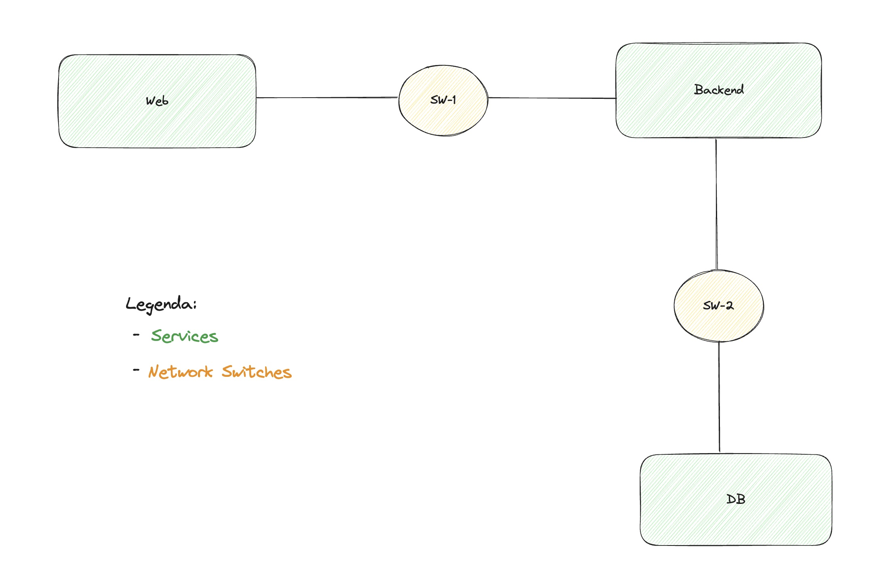
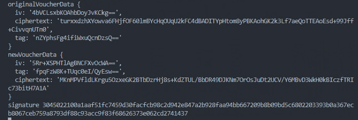

# A24 BombAppetit Project Read Me

## Team

| Number | Name              | User                                 | E-mail                                           |
| -------|-------------------|----------------------------------    | -------------------------------------------------|
| 95555  | Diogo Venâncio    | <https://github.com/Diogo-V>         | <mailto:diogo.costa.venancio@tecnico.ulisboa.pt> |
| 92541  | Pedro Abreu       | <https://github.com/pedroabreu00>    | <mailto:pedro.miguel.abreu@tecnico.ulisboa.pt>   |
| 99303  | Pedro Martins     | <https://github.com/PedromcaMartins> | <mailto:pedromcamartins@tecnico.ulisboa.pt>              |

[](img/diogo.jpeg)  

## Contents

This repository contains documentation and source code for the *Network and Computer Security (SIRS)* project.

The [REPORT](REPORT.md) document provides a detailed overview of the key technical decisions and various components of the implemented project.
It offers insights into the rationale behind these choices, the project's architecture, and the impact of these decisions on the overall functionality and performance of the system.

This document presents installation and demonstration instructions.

## Installation

To see the project in action, it is necessary to setup a virtual environment, with N networks and M machines. Each service will run in a different machine.

The following diagram shows the networks and machines:

[](img/networks.jpg)

### Prerequisites

To configure the above setup, it will required to have the following software installed:

* [Vagrant](https://developer.hashicorp.com/vagrant/docs/installation)

* [VirtualBox](https://www.virtualbox.org/)

### Machine configurations

To create the entire setup above, you will have to run the command:

```sh
$ vagrant up
```

The command will take a while to run but once it finishes, and if all goes well, when running the command below, you will have all the machines running:

```sh
$ vagrant status
```

To access the application, you will have to go to this [link](https://localhost:8080). It will be running in your localhost under the port 8080.


In order to decrease the development time of the project, we added a feature to automatically sync the files between the host and the VMs. To enable this feature, you will have to run the following command:

```sh
$ vagrant rsync-auto
```

#### Machine: web

The web service will run a [SvelteKit](https://kit.svelte.dev/) application. This will create a web server hosted in port 3000 (this port will get mapped to 8080 on the host VM so that it can be accessed from the outside).

This service is responsible for serving content to the user and forwarding his requests to the backend for processing.

#### Machine: backend

The backend service will run a [FastApi](https://fastapi.tiangolo.com/) application. This will create a REST server hosted on port 8000.

This service is responsible for all communications made with the database as well as serving content to the web service.

#### Machine: db

The db service will run a [MySQL](https://www.mysql.com/) application. This will create a database hosted on port 3306.

This service is responsible for persistently storing information.

### How to debug

To access the machine, you can run the following command:

```sh
$ vagrant ssh <name>
```

Where `<name>` stands for one of `web, backend, db`.

In here, you will have full access to the VM and can inspect all files inside of it.

The logs of all applications inside each VM are being written to a file called `output.log` in the user directory `~`. You can follow its contents during usage with the following command:

```sh
vagrant-web@~: tail -f output.log
```

## Demonstration


To seamlessly see changes to the host code reflected in the application, it is recommended to sync the files between the host and the VMs using `vagrant rsync-auto`, as explained above. 

Now that all the networks and machines are up and running, lets demonstrate some of the security features of the app.

To facilitate swapping between users, we added a dropdown in the top right corner of the landing page to simulate logins:

[](img/dropdown.jpg)


#### Backend-DB SSL Communications:

SSH into the backend VM with:

```sh
$ vagrant ssh backend
```

Try to run:

```sh
$ mysql -h db -u user -ppassword -e "USE db; SELECT * FROM restaurant;" 
```

Now try to run:

```sh
$ mysql -h db -u user -ppassword  --ssl-ca="/home/vagrant/client-ssl/ca-db-cert.pem" --ssl-cert="/home/vagrant/client-ssl/client-cert.pem" --ssl-key="/home/vagrant/client-ssl/client-key.pem" -e "USE db; SELECT * FROM restaurant;" 
```

Expected result:
[](img/demos/ssl/ssl_db.jpg)

The first command didn't work because it was trying to connect to the db without using SSL, so the connection was denied.

#### Web-Backend SSL Communications:

SSH into the web VM with:

```sh
$ vagrant ssh web
```

Try to run:

```sh
curl http://backend:8000/v1/restaurants/
```

Now try to run:

```sh
curl --cacert /home/vagrant/client-ssl/ca-backend-cert.pem --cert /home/vagrant/client-ssl/client-cert.pem --key /home/vagrant/client-ssl/client-key.pem -H "userId: "1"" https://backend:8000/v1/restaurants/
```

Expected result:
[](img/demos/ssl/ssl_backend.jpg)

The first command didn't work because it was trying to connect to the backend without using SSL, so the connection was denied.

#### User-Web SSL Communications:

Open your web browser in the host machine on: [http://localhost:8080](http://localhost:8080)

You can't access our web application if you don't connect through htpps. 

Now open it on:  [https://localhost:8080](https://localhost:8080)

After connecting with https, open the app's certificate on the browser and check that the subject's name is A24 BombAppetit Web Server and the issuer's name is WebServer_CA.

Expected result:
[](img/demos/ssl/ssl_web.jpg)

#### Document authenticity

All responses from the backend are validated for their authenticity and so, fetching the document (the restaurant data) is also validated. All flows in the application are the same regarding this and so, we are going to demonstrate it with an example by fetching the restaurants data.

If a request is valid in terms of authenticity - the web service validates that the response from the server is indeed his and was not tampered with - the payload is used to hydrate the page with the data:

[](img/demos/doc_auth/valid.jpg)

Web             |  Backend
:-------------------------:|:-------------------------:
  |  

If data is intercepted by an attacker and in any way changed, the following will appear:

[](img/demos/doc_auth/invalid.jpg)

To simulate tampering with the data, we can append something to the data as follows:

[](img/demos/doc_auth/change_hashes.jpg)

#### Voucher confidentiality and redeemability

Regarding the confidentiality of the vouchers, firstly, when a user navigates to a page of any restaurant, all available vouchers for it that are associated with that user are shown as well as an text input to write the code of the voucher in at time of redeeming:

[](img/demos/voucher_conf/vouchers_list.jpg)

When a user navigates to this page, the voucher data comes encrypted with the user's public key so that it is only accessible to the owner:

[](img/demos/voucher_conf/data.jpg)

It is then decrypted and shown to the user in the page.

If a user that does not own the voucher tries to "guess" the code and inserts it in the input box, the following will be shown:

[](img/demos/voucher_conf/invalid.jpg)

If the voucher does not exist, the following alert will pop up:

[](img/demos/voucher_conf/not_found.jpg)

#### Review validation

When a user creates a review, he signs it to provide guarantees to other users that this review is authentic. Any user can verify if a review is valid by checking if the signature is valid.

To create a review, a user will click on the restaurant followed by clicking the `+` button next to the reviews:

[](img/demos/review_val/create.jpg)

To validate a review, a user can click the `Verify` button. If all is well, the an alert will be shown to the user as follows:

[](img/demos/review_val/valid.jpg)

If the review is not valid (we can simulate this by tampering the data as we did above), an alert will be shown to the user with the following message:

[](img/demos/review_val/invalid.jpg)

Web             |  Backend
:-------------------------:|:-------------------------:
  |  

#### Voucher gifts

Regarding voucher gifts, a user can gift a voucher to another user by selecting the new owner using a dropdown:

[](img/demos/voucher_gift/Gift_dropdown.png)

When a user clicks the gift button, a popup will appear with the result:

[](img/demos/voucher_gift/gift_result_ok.png)

After refreshing the web page, we can see the voucher is also no longer available to the user that gifted it.

[](img/demos/voucher_gift/Result_original_owner.png)

After changing to the user that received the voucher (User 2 in this example), the voucher is now available in the interface. 

[](img/demos/voucher_gift/User_2_selected.png)

[](img/demos/voucher_gift/Result_new_owner.png)

This is the log of the backend. We can see the voucher data encrypted and only accessible by the original owner and the new voucher data below. The ivs, tags and ciphertext changed as a result of the gift. The signature of the original owner is also sent with the new data, which the backend uses to validate the request as being made by the original owner.

[](img/demos/voucher_gift/Backend.png)

If the original owner's signature sent with the new data is not valid:

[](img/demos/voucher_gift/Backend_incorrect_signature.png)

[](img/demos/voucher_gift/Backend_evil_action.png)

The voucher data is not changed and the gift is not made. 

[](img/demos/voucher_gift/gift_result_fail.png)

In the process of exchanging the voucher, if an attacker intercepts the voucher data and changes it, the backend will detect that the voucher data is not valid and will not allow the exchange to happen.

Loading keys of the original owner and the new owner:

[](img/demos/voucher_gift/Backend_load_keys_ok.png)

Loading keys of the original owner and the evil user:

[](img/demos/voucher_gift/Backend_load_keys_nok.png)

[](img/demos/voucher_gift/Backend_incorrect_user_fail.png)

[](img/demos/voucher_gift/gift_result_fail.png)


## Additional Information

### Links to Used Tools and Libraries

Python:

* [Python 3.10.6](https://www.python.org/downloads/release/python-3106/)

* [Pip 22.0.2](https://pip.pypa.io/en/stable/)

* [uvicorn 0.20.0](https://pypi.org/project/uvicorn/)

* [fastapi 0.103.0](https://pypi.org/project/fastapi/)

* [sqlalchemy 2.0.9](https://pypi.org/project/sqlalchemy/)

* [pymysql 1.0.2](https://pypi.org/project/pymysql/)

* [structlog 23.1.0](https://pypi.org/project/structlog/)

* [cryptography 41.0.1](https://pypi.org/project/structlog/)

Javascript/Typescript:

* [Node 18](https://nodejs.org/en)

* [npm 8.19.2](https://www.npmjs.com/)

* [@sveltejs/adapter-node 1.2.3](https://www.npmjs.com/package/@sveltejs/adapter-node)

* [@sveltejs/kit 1.5.0]("https://www.npmjs.com/package/@sveltejs/kit)

* [@types/node](https://www.npmjs.com/package/@types/node)

* [svelte 4.0.5](https://www.npmjs.com/package/svelte)

* [vite 4.3.0](https://www.npmjs.com/package/vite)

* [vitest 0.25.3](https://www.npmjs.com/package/vitest)

* [crypto 1.0.1](https://www.npmjs.com/package/crypto)

* [elliptic 6.5.4](https://www.npmjs.com/package/elliptic)

### Versioning

We use [SemVer](http://semver.org/) for versioning.  

### License

This project is licensed under the MIT License - see the [LICENSE.txt](LICENSE.txt) for details.

----
END OF README
