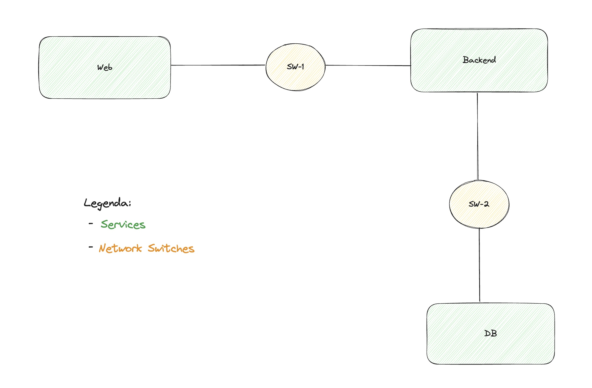
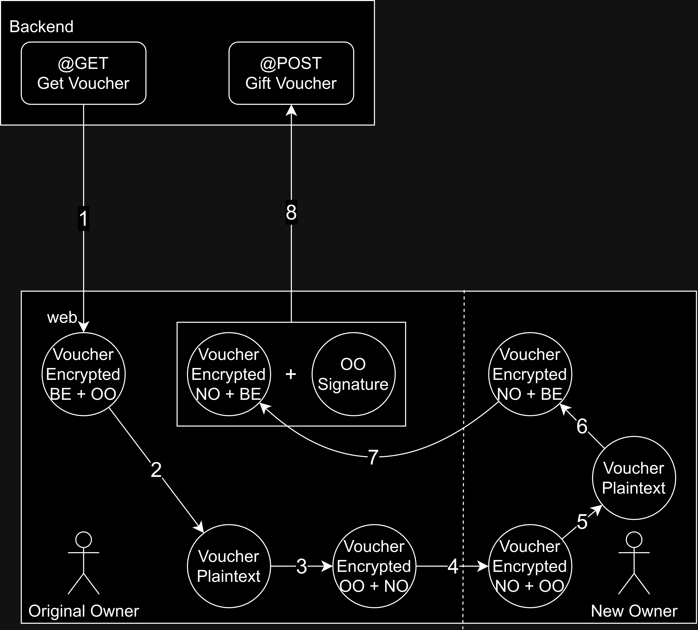

# A24 BombAppetit Project Project Report

## 1. Introduction

Our project consists on a web application that allows users to browse through restaurants in the area and their menus. Users can post reviews, verify the validity of reviews, redeem vouchers on these restaurants (provided the user has access to the code he is trying to use), and gift vouchers to other users(provided the original owner has access to the code he is trying to give). The reviews are non-repudiable and other users are able to verify the authenticity of each review. Each voucher is tied to a specific user and can only be used once, users can also directly transfer vouchers to other users of the app.

To secure the documents used by the application, the team developed a custom cryptographic library that provides key generation, key management, encryption and decryption and digital signatures. The library is designed to be used by the application, and is invoked by the application to protect and unprotect documents, and to verify the authenticity of documents.

Every HTTP response from the backend to the web is verified by the web to ensure that the response was not tampered with. It uses key derivation to digitally sign the response and verify the signature on the web. 

The infrastructure is built with Vagrant, which sets up 3 VMs: **'db'** (running mysql), **'backend'** (running python), **'web'** (running node). The VMs have firewalls setup to ensure only allowed communications go through. All the connections between the VMs are encrypted with SSL. 

The security challenge introduced two new requirements, the reviews with classifications made by users and the possibility of exchanging vouchers between users. 
The team extended the existing cryptographic library to  generate and verify digital signatures. The reviews are non-repudiable by allowing users to validate its authenticity. 
The team extended the existing cryptographic library to provide dynamic key distribution functionality. The vouchers can be directly transfered (gifted, in the application) to other users securely by using the dynamic key distribution functionality in combination with document encryption and decryption.


## 2. Project Development

### 2.1. Secure Document Format

#### 2.1.1. Design

The team developed their security solutions based on the OWASP standards, which are the most widely used standards in the industry. The team also used the [OWASP CheatSheet](https://cheatsheetseries.owasp.org/index.html) as a reference for the implementation of the security solutions. 

##### Key Management

It is assumed that the keys used in the application have been previously generated and stored in the filesystem. The application loads the keys from the filesystem and uses them for encryption and decryption. The application does not generate keys. 

The public and private keys are stored and loaded in PEM format.

**The web server stores** the private and public keys of the users and the public key of the backend server. 

**The backend server stores** the public keys of the users and the public and private key of the backend server itself. 

**No keys are stored in the database, and no keys are transmitted over the network.**

##### Key Generation

As [recommended by OWASP](https://cheatsheetseries.owasp.org/cheatsheets/Cryptographic_Storage_Cheat_Sheet.html#algorithms), the team used Elliptic Curve Cryptography (ECC) for key generation. This is a more secure and efficient algorithm than RSA, which is the most widely used algorithm for key generation. The team used the SECP256K1 elliptic curve algorithm, also known as P-256, for generating key pairs. This algorithm is used for digital signatures and can be used in ECDH key exchange. 

Function for generating key pair:

```python
def generate_key_pair() -> (ec.EllipticCurvePrivateKey, ec.EllipticCurvePublicKey):
    private_key = ec.generate_private_key(ec.SECP256K1(), default_backend())
    public_key = private_key.public_key()

    return private_key, public_key
```

##### Key Derivation

The Elliptic Curve Diffie-Hellman (ECDH) key exchange generates a shared secret between the two parties, which is used as the symmetric key for encryption and decryption. 

Function for deriving key:

```python
def derive_key(private_key: ec.EllipticCurvePrivateKey, public_key: ec.EllipticCurvePublicKey) -> bytes:
    shared_secret = private_key.exchange(ec.ECDH(), public_key)
    return shared_secret
```

Example usage of derived key:

```python
alice_private_key, alice_public_key = generate_key_pair()
bob_private_key, bob_public_key = generate_key_pair()

alice_derived_key = derive_key(alice_private_key, bob_public_key)
bob_derived_key = derive_key(bob_private_key, alice_public_key)

assert alice_derived_key == bob_derived_key
```

The symmetric key is never stored, and the private key is never transmitted, ensuring that the symmetric key is only known to the encryptor and decryptor. 
This approach combines the security of asymmetric encryption with the efficiency of symmetric encryption, without sacrificing security.


##### Digital Signatures

The team developed two types of digital signatures, one for documents (security challenge) and one for HTTP requests and responses.


###### HTTP Signatures

All HTTP responses are composed of a JSON with the data and the signature. The data is the actual data that the user requested, and the signature allows for the authenticity of the data to be verified.

Format of BackendResponse:

```json
{
  "data": "data",
  "signature": "signature"
}
```

The HTTP signature allows the web server and backend to verify the authenticity of the HTTP requests and responses. The hash of the data (generated with the SHA-256 hash algorithm) is encrypted with the shared secret between the web and the backend. This way, the signature is generated and verified using the shared secret of the web (technically user, as the web uses the user's keys) and the backend.

Function for signing HTTP request:

```python
def sign_data(data_bytes: bytes, server_private_key: ec.EllipticCurvePrivateKey, user_public_key: ec.EllipticCurvePublicKey) -> EncryptedData:
  data_hash = hashlib.sha256(data_bytes).hexdigest()
  encrypted_data = encrypt(server_private_key, user_public_key, data_hash.encode())
  return encrypted_data
```
_(This function is a simplified version of the actual function, which also includes loading the keys from the filesystem and stringifying json data)_

This approach allows for authenticity that can only be verified by backend and the user that specifically requested the data. 


##### Encryption and Decryption

The encryption process uses the AES-GCM mode, providing confidentiality, integrity, and authenticated encryption.

The resulting encrypted document is a JSON, with initialization vector (IV), tag (MAC), and ciphertext attributes.

OWASP recommends [AES](https://cheatsheetseries.owasp.org/cheatsheets/Cryptographic_Storage_Cheat_Sheet.html#algorithms) and [GCM](https://cheatsheetseries.owasp.org/cheatsheets/Cryptographic_Storage_Cheat_Sheet.html#cipher-modes) for its security and efficiency.

The IV is generated using the `secrets.token_bytes` (_python_) and `crypt.randomBytes` (_javascript_) library, which provides cryptographically secure random numbers. The IV is used to randomize the encryption process, ensuring that the same plaintext does not result in the same ciphertext.

The tag is generated by the AES-GCM algorithm, and is used to verify the integrity of the ciphertext. The tag is used to verify that the ciphertext has not been tampered with.


##### Document Protection

The business scenario requires the application to ensure authenticity of the restaurant data, and confidentiallity of the voucher data. 

Authenticity is ensured in every HTTP response, as explained in the HTTP Signatures section. 

The voucher data confidentiality is ensured by encrypting the voucher data with the shared key between the user assigned to the voucher and the backend server. This way, only the user assigned to the voucher can decrypt the voucher data, and be able to access it. 

The backend server stores the restaurant and voucher data in plaintext. When the backend requests data from the database, it is sent through a TLS connection, ensuring confidentiality and integrity of the data. The backend protects the restaurant data using the HTTP signatures, and protects the voucher data using encryption, as explained above. 

This approach meets the business scenario requirements for restaurant data and voucher data. 


#### 2.1.2. Implementation

The implementation of the security solution is in Python and Javascript, using libraries that provide cryptographic functionality and secure random number generation. 

The python scripts are invoked from the command line and backend application, and the javascript scripts are invoked from the web application. 

##### Custom Cryptographic Scripts

The core functionality is encapsulated in a script that provides functions for file protection (protect), checking security (check), file unprotection (unprotect), and key pair generation (generate_key_pair).
The script is designed to be invoked from the command line, allowing users to specify the operation and relevant parameters. 

The script is invoked with the following command:

```bash
python3 scripts/crypto_lib.py <function> <parameters>
```

This script only provides the core functionality, and is not used by the application. It does not support digital signature verification. 

##### Custom Cryptographic Libraries

The cryptography libraries are available in python and javascript, and are used by the application to protect and unprotect documents, and to verify the authenticity of documents. 

These libraries can be found in the `services\backend\src\security` and `services\web\src\lib\services` folders. 

##### Cryptographic Libraries

The cryptographic libraries ised in python by the application are:
- cryptography
- secrets
- hashlib

The cryptographic libraries ised in javascript by the application are:
- crypto
- elliptic


##### Challenges Faced

The usage of eliptic curve cryptography (ECC) for key generation and key exchange required a thorough understanding of the cryptography library and the underlying algorithms, due to the lack of example code in the lab materials.


##### Challenges Overcome

Using online resources, the team was able to understand the cryptography library and the underlying algorithms, and successfully implement the required functionality.


### 2.2. Infrastructure

#### 2.2.1. Network and Machine Setup

The infrastructure is setup using Vagrant and VirtualBox. No user input is required other than running ```vagrant up``` and opening the VirtualBox GUI (the GUI has to be opened or else vagrant will get stuck). Setting up all the VMs for the first time may take between 10 to 15 minutes.

Vagrant sets up 3 VMs: **'db'**, **'backend'** and **'web'**. These are Ubuntu/focal64 boxes that will be provisioned using shell scripts that setup SSL certificates, firewalls and the software intended to run on the VM. Two private networks will also be created. **'sw-1'**, **'sw-2'**. 

The following diagram shows the networks and machines:

[](img/networks.jpg)


Not present in the diagram but 'web' also has a port forwarded from the host pc to the guest 'web' VM.

```web.vm.network "forwarded_port", guest: 3000, host: 8080``` on [Vagrantfile](https://github.com/tecnico-sec/a24-pedro-diogo-pedro/blob/ready/Vagrantfile)

This allows us to use our application in the host pc opening a web browser on [https://localhost:8080/](https://localhost:8080/)

#### 2.2.2. Server Communication Security


Server communications were secured by 3 key features: 
  + **Isolated private networks:**
  DB is isolated from any communication with anyone other than backend.
  + **Firewalls:**  
  Each VM sets its iptable rules right after starting the respective app. To sum up the firewall rules we can say that every VM accepts connections on port 22 over TCP (SSH) and ICMP packets. Port 22 is required to be opened for Vagrant to work. Then rules are added to ensure each machine only accepts connections from known hosts in certain ports. For example the backend accepts connections to/from the db and accepts connections on port 8000 (python app) from the web VM. The web VM is configured to accept any connection on port 3000 (host port 8080).
  + **SSL Encrytption:**
  Every connection between the VMs and between the web VM and clients is encrypted with SSL. The certificates and keys for SSL encryption are all generated when running ```vagrant up```.  The keys used for SSL are generated using the Eliptic Curve prime256v1 algorithm:

```
sudo openssl req -newkey ec -pkeyopt ec_paramgen_curve:prime256v1 -nodes -keyout client-key.pem -out client-req.pem -subj "/CN=MySQL_Client"
```

Distribuition of keys and certificates in the context of SSL connections between the VMs:

  + No keys or certificates exist at the start. 

  + db will be the first to boot up, a script will generate a CA cert/key and a server-db cert/key signed by the CA. This CA cert/key is copied to a shared folder between the VMs. It is then used by the backend to sign a client certificate which is used to connect to the db.

  + backend will be the second to boot, a script will generate a client certificate using the CA generated by the db as stated above. Then the same process occurs but for the connection between backend and web. Backend will generate a different CA cert/key and a server-backend cert/key signed by the CA. This CA cert/key is copied to a shared folder between the VMs. It is then used by the web to sign a client certificate which is used to connect to the backend.

 + web is the last to boot, a script will generate a client certificate using the CA generated by the backend as stated above. Then the same process occurs but for the connection between web and users. Web will generate a different CA cert/key and a server-web cert/key signed by the CA. This server-web certificate can be seen by the users in their browsers to confirm that they are in fact connecting to the right application.


### 2.3. Security Challenge

#### 2.3.1. Challenge Overview

<!-- (_Describe the new requirements introduced in the security challenge and how they impacted your original design._) -->

The security challenge introduced two new requirements, the reviews with classifications made by users and the possibility of exchanging vouchers between users.

For the first requirement, we had to implement all the routing, navigation and models in the database associated with it before starting on the security section.

For it, we had to make the reviews non-repudiable by allowing users to validate its authenticity. To do so, when a user creates a review, he hashes and encrypts its content (signs it) and appends this value to the payload when sending it to the backend for storage. When another user wants to verify the authenticity of a review, he verifies the signature of it by hashing the payload, decrypting the signature field using the reviewer's public key and finally by comparing the hashes together.

As for the second requirement, firstly, same as the first requirement, we had to implement all the routing, models, etc... before tackling the security challenge involved with it.

For this one, the web had to exchange the vouchers between users securely. To do so, we used key derivation in combination with document encryption and decryption. The owner exchanges, securely, the voucher data with the new owner, in a series of encryptions and decryptions, without the need for the backend to decrypt the voucher. The backend only verifies the original owner's signature alongside the voucher data stores it in the database.

#### 2.3.2. Attacker Model

(_Define who is fully trusted, partially trusted, or untrusted._)

(_Define how powerful the attacker is, with capabilities and limitations, i.e., what can he do and what he cannot do_)

#### 2.3.3. Solution Design and Implementation

The team extended the existing cryptographic library to generate and verify digital signatures. 

##### Document Signatures

The document signature allows users to verify the authenticity of documents. The signature uses Elliptic Curve Digital Signature Algorithm (ECDSA) with the SHA-256 hash algorithm. The signature is generated using the private key of the signer, and verified using the public key of the signer.

Function for signing document:

```python
def sign_asym(private_key: ec.EllipticCurvePrivateKey, data: str) -> bytes:
    signature = private_key.sign(
        data.encode('utf-8'),
        ec.ECDSA(hashes.SHA256())
    )
    return signature
```

Function for verifying document signature:

```python
def verify_asym(public_key: ec.EllipticCurvePublicKey, data: str, signature: bytes):
    try:
        public_key.verify(
            signature,
            data.encode('utf-8'),
            ec.ECDSA(hashes.SHA256())
        )
        return True
    except Exception as e:
        print(f"Signature verification failed: {e}")
        return False
```

This approach was chosen because it is the most widely used algorithm for digital signatures, and is [recommended by OWASP](https://cheatsheetseries.owasp.org/cheatsheets/Key_Management_Cheat_Sheet.html#digital-signatures).


##### Non-Repudiation of Reviews

For the non-repudiation of reviews, the team used the document signature to sign the review. The signature is generated using the private key of the reviewer, and verified using the public key of the reviewer.

Example usage of review signature:

```python
const signature = sign(privateKey, review);
```

Example of review signature:

```json
{
  "reviewer": "user1",
  "restaurant": "restaurant1",
  "rating": 5,
  "comment": "comment",
  "signature": signature
}
```

This approach allows for authenticity that can only be verified by the reviewer, and cannot be forged by a third-party. 

This satisfies the business scenario requirement for non-repudiation of reviews.

##### Gift Vouchers

For the gift vouchers, the team used the Key Derivation to generate a shared secret between the current owner and the new owner. 

When a user wants to gift a voucher to another user, the following process occurs:

1. The web requests the voucher from the backend. The backend encrypts the voucher with the shared secred of the current owner and the backend server. 
3. The web server (As the owner) decrypts the voucher. 
4. The original owner sends the voucher to the new owner. In practice, this is not done, as the web server manages the voucher exchange.
5. The web server encrypts the voucher with the shared secret of the current owner and the new owner. 
6. The web server (As the new owner) decrypts the voucher.
7. The web server encrypts the voucher with the shared secret of the new owner and the backend server.
8. The web server (As the old owner) signs the voucher and sends the voucher to the backend server.
9. The backend server verifies the signature and stores the voucher in the database.

Visually, the process is as follows:

[](img/voucher_exchange.png)

The following is the code for the voucher exchange between users (in the web server), which can be found in the `services\web\src\routes\api\vouchers\[id]\+server.ts` file:

```javascript
    const originalVoucher = getResponse.data

    /* ------------- decrypts voucher BE + OG Owner && encrypts voucher OG Owner + New Owner ------------- */
    const ogOwnerBackendPlaintextVoucherData = decrypt(
      ogOwnerPrivateKey, 
      serverPublicKey, 
      originalVoucher.data
    )
    const ogOwnerNewOwnerCyphertextVoucherData = encrypt(
      ogOwnerPrivateKey,
      newOwnerPublicKey, 
      ogOwnerBackendPlaintextVoucherData
    )

    /*       WHAT IS HAPPENING HERE IS EXCHANGE OF VOUCHERDATA BETWEEN USERS      */

    /* ------------- decrypts voucher OG Owner + New Owner && encrypts voucher New Owner + BE ------------ */
    const newOwnerOgOwnerPlaintextVoucherData = decrypt(
      newOwnerPrivateKey, 
      ogOwnerPublicKey, 
      ogOwnerNewOwnerCyphertextVoucherData
    )
    const newOwnerBackendCyphertextVoucherData = encrypt(
      newOwnerPrivateKey, 
      serverPublicKey, 
      newOwnerOgOwnerPlaintextVoucherData
    )

    const newVoucherData = newOwnerBackendCyphertextVoucherData

    const signature = sign(ogOwnerPrivateKey, body.newOwner)
```

_(This code is a simplified version of the actual code, which also includes loading the keys from the filesystem)_

The data returned to the backend is as follows:

```json
{
  "code": "10OFF",
  "newOwner": "2",
  "newVoucherDataIv": iv
  "newVoucherDataTag": tag
  "newVoucherDataCiphertext": ciphertext
  "originalOwnerSignature": signature
}
```

This approach allows for confidentiality of the voucher data, and authenticity of the voucher data. Also, this approach allows for the voucher to be transferred between users, without the need for the backend to decrypt the voucher. And finally, no keys are shared between users, ensuring that the voucher data is only known to the current owner and the new owner.

This satisfies the business scenario requirement for gift vouchers.


## 3. Conclusion

The team was able to build a web application to browse restaurants/post reviews/redeem vouchers/gift vouchers, satisfying all the requirements.

The authenticity of the data is achieved by signing it (hash followed by encrypting with the private key) and appending the result to the payload. Subsequently, a user verifies the signature by decrypting it and comparing the hashes of the payload. If they match, this ensures that the data was generated only by the holder of the private key and was not tampered with.

The confidentiality of the vouchers is achieved by encrypting it the user's public key. When a piece of data is encrypted with the public key, it ensures that only a holder of it's corresponding private key can access it, making it confidential.

The gift vouchers are exchanged between users by utilizing key derivation, document encryption, and decryption. This ensures the voucher data is securely transferred from the original owner to the new owner without the need for key exchange between users and the backend to decrypting the voucher. The backend server only verifies the original owner's signature and stores the voucher data (encrypted with the shared key of the new owner and the backend) in the database. This approach ensures confidentiality and authenticity of the voucher data, satisfying the business scenario requirement for gift vouchers.

The non-repudiation of the reviews is achieved by allowing users to verify the authenticity of it. When a review is created, the user signs it and appends this result to the payload before sending to the backend. When another user wants to verify that the review was indeed made by that user, they use the reviewer's public key to decrypt the signature and compare the hashes. If they match, it ensures that the review was not, in any way, updated by a third-party.

We would like to have implemented user authentication through a form in the browser and we would have implemented reservations with more time.

Overall we feel pretty satisfied with our work as it's working as we intended when we were first planning it. We made the choice to develop a web app and not a console program and that's closer to the real world scenarios where we would apply what we learned, so we are happy to have it all working properlly with the same security it would have if it was a console program.  The project allowed us to deepen our knowledge of secure communications and allowed each one of us to gain hands on experience with tecnologies we hadn't used before.

## 4. Bibliography

<!-- (_Present bibliographic references, with clickable links. Always include at least the authors, title, "where published", and year._) -->

[OWASP](https://owasp.org/) was heavily used throughout the execution of the project, especially the [CheatSheet](https://cheatsheetseries.owasp.org/index.html) as it provides practical and insightful information in a clear and concise way.

----
END OF REPORT
