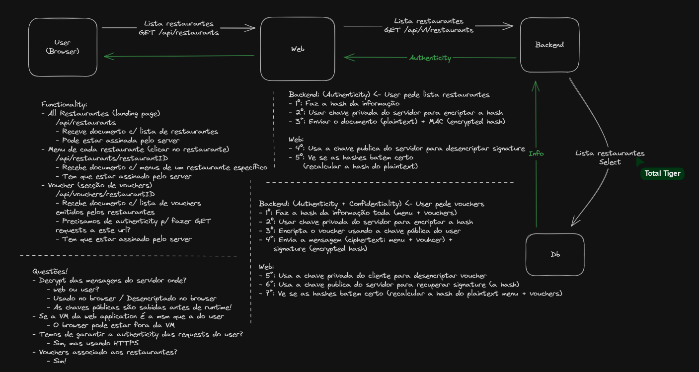

### Links
[Projeto Enunciado](https://github.com/tecnico-sec/Project-Overview-2024_1)

[Project Scenario](https://github.com/tecnico-sec/Project-Scenarios-2024_1#2-restaurants--tourism-bombappetit)

[Projeto Repository](https://github.com/tecnico-sec/a24-pedro-diogo-pedro)


### Tarefas %% TODO: Tasks %%

- Certificados SSL / TLS -> HTTPS
  - Web, Backend, DB
  - Para comunicação
  - Migrar HTTP -> HTTPS

- Firewall
  - HTTPS -> porta 443
  - Port forwarding 443 -> application port (Firewall infrastructure)
  - Bloquear ips e portas not used
  - EngineX (tool)

- Secure Documents
  - [X] Fix cenas stor
  - [X] decrypt a correr em javascript
  - [ ] Mudar a base de dados para usar comunicações SSL
  - [ ] Adicionar comunicação SSL entre backend e web
  - [ ] Implementar partilha de vouchers entre os users

- Erros
  - Faltam pastas
  - Não sabia as interfaces que ia precisar


### Arquitetura



### Perguntas

- Gerar chaves at startup time?
  - Não. já estão criadas
- Cada user vai ter a sua key pair?
  - Sim
- Vamos ter users dinamicos?
  - Não. Vamos ter users hardcoded
- A base da dados fica em plaintext? Temos que enviamos os dados todos para o backend?
  - Depende... O professor vai pensar
- O que o check faz?
  - Verifica o JSON?


## Business Scenario: Restaurants & Tourism: BombAppetit

BombAppetit is a web application tailored to enhance the dining experience.
It simplifies restaurant reservations with an intuitive interface.
Users can explore a curated list of local restaurants based on their location, making it easy to find the perfect dining spot.
BombAppetit facilitates table reservations for any group size.  
The system integrates with a discount card service, allowing patrons to redeem their accumulated points for attractive booking discounts.
BombAppetit revolutionizes dining convenience, connecting users with delightful culinary experiences.

The core data handled by the application is exemplified next:

```json
{
  "restaurantInfo": {
    "owner": "Maria Silva",
    "restaurant": "Dona Maria",
    "address": "Rua da Glória, 22, Lisboa",
    "genre": ["Portuguese", "Traditional"],
    "menu": [
      {
        "itemName": "House Steak",
        "category": "Meat",
        "description": "A succulent sirloin grilled steak.",
        "price": 24.99,
        "currency": "EUR"
      },
      {
        "itemName": "Sardines",
        "category": "Fish",
        "description": "A Portuguese staple, accompanied by potatoes and salad.",
        "price": 21.99,
        "currency": "EUR"
      },
      {
        "itemName": "Mushroom Risotto",
        "category": "Vegetarian",
        "description": "Creamy Arborio rice cooked with assorted mushrooms and Parmesan cheese.",
        "price": 16.99,
        "currency": "EUR"
      }
    ],
    "mealVoucher": {
      "code": "VOUCHER123",
      "description": "Redeem this code for a 20% discount in the meal. Drinks not included."
    }
  }
}
```

### Protection Needs

The protected document must ensure the _authenticity_ of the restaurant data.
If a voucher exists, it should be _confidential_ so that only the user should be able to access it.  
You can assume that the user and the service share their respective public keys.


### Security Challenge

(to appear later)


### Business needs
- Users can explore a curated list of local restaurants based on their location
- BombAppetit facilitates table reservations for any group size
- The system integrates with a discount card service, allowing patrons to redeem their accumulated points for attractive booking discounts
- Protected document of the restaurant data


### Q&A
- Users can explore a curated list of local restaurants based on their location
	- Podemos usar a localização p/ escolher as localizações ao pé do user
	- Não gastar muito tempo
- BombAppetit facilitates table reservations for any group size
	- Tem que haver lógica de reservas
	- Esta informação não é encriptarda a nivel da app
- The system integrates with a discount card service, allowing patrons to redeem their accumulated points for attractive booking discounts.
	- Fazer lógica muito simples de pontos
	- Lógica de pontos != lógica de descontos
	- Fazer lógica de redeem de pontos
---
- Cada user tem uma MIC/MAC?
	- O serviço e cada cliente têm um par de chaves
		- O servidor só tem 1 par de chaves
	- Known keys: publicas dos clientes e serviços
	- O Voucher produzido no server tem que usar a chave pública do utilizador que recebe o voucher
		- O user usa a chave privada para a desencriptar
	- Mensagem para o server: usar chave pública do server para o server desencriptar
	- O server não tem a nossa chave privada, ao contrário das aplicações web usada
---
- Authenticity: Usar chave privada do server
	- Protected document (plaintext)
	- Voucher (cyphertext)
- Confidentiality: Usar chave pública do user que a vai receber
	- Voucher

- Que documento vamos enviar? JSON, ...


